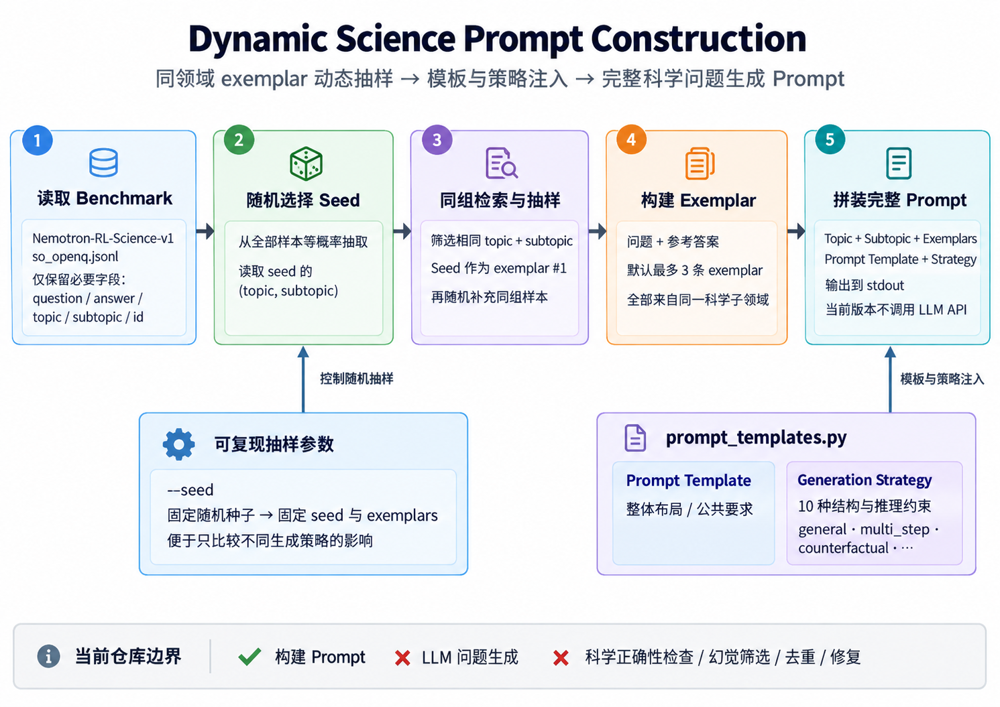

# Dynamic Science Prompt Construction

本仓库用于从真实的开放式科学问答 benchmark 中动态抽取同一科学子领域的示例，并构建用于生成新科学问题的 Prompt。

当前版本只负责构建和打印 Prompt，不调用任何 LLM API，也不执行问题生成、幻觉检测、事实核验、去重或修复。

## 流程概览



## 使用的 Benchmark

当前使用 [NVIDIA Nemotron-RL-Science-v1](https://huggingface.co/datasets/nvidia/Nemotron-RL-Science-v1) 的 `so_openq` 数据：

- 150,644 条英文开放式科学问答；
- 覆盖 Physics、Chemistry 和 Biology；
- 包含 39 个 `(topic, subtopic)` 组合；
- 核心字段为 `problem`、`expected_answer`、`metadata.topic` 和 `metadata.subtopic`；
- 数据许可证为 [CC BY-SA 4.0](https://creativecommons.org/licenses/by-sa/4.0/)。

原始数据约 266 MB，不纳入 Git 仓库。每条数据的具体来源和许可证信息以原始数据集中的 `metadata.QuestionLink` 和 `license` 字段为准。

同时已下载 [MatSciBench](https://huggingface.co/datasets/JunkaiZ/MatSciBench) 的
Parquet 数据，用于材料科学问题抽样。当前只使用同时具有问题、答案和详细解答且
不含图片的记录；Prompt exemplar 只展示问题和简短答案，不展示详细解答。

## 当前状态

当前已经实现：

- 通过独立 adapter 将 Nemotron 和 MatSciBench 转换为统一 `Sample`；
- 审计 MatSciBench 的缺失答案、缺失解答、图片和视觉引用；
- 默认筛选同时具有问题、答案和解答且不含图片的材料样本；
- 支持通过 `--domain` 选择 Biology、Chemistry 或 Materials；
- 未指定领域时，在上述三个领域中等概率随机选择；
- 直接逐行读取 Nemotron 原始 JSONL；
- 在内存中仅保留构建 Prompt 所需字段；
- 随机选择一个 seed 样本；
- 按相同 `(topic, subtopic)` 寻找候选；
- 默认使用 seed 加最多两条同组问题，共最多三个 exemplar；
- 从独立、可版本化的模板模块加载 Prompt 文本；
- 支持 10 种具有不同结构约束的问题生成策略；
- 构建并打印要求模型生成开放式科学问答的完整 Prompt；
- 支持通过随机种子复现抽样结果。

当前尚未实现：

- 复杂的数据质量过滤；
- 模型调用与生成结果保存；
- 科学正确性检查、幻觉筛选和去重。

Physics 不在当前目标领域中，不会进入 Prompt。当前不对各领域内部的 subtopic
进行均衡；选定领域后，先随机选择 seed，再抽取与 seed 相同 subtopic 的 exemplar。

## 项目结构

```text
.
├── benchmark/
│   └── raw/
│       ├── nemotron/
│       │   └── so_openq.jsonl       # 本地下载，不纳入 Git
│       └── matscibench/
│           └── MatSciBench.parquet  # 本地下载，不纳入 Git
├── benchmark_adapters.py   # Benchmark 读取、过滤、统一数据模型与自检入口
├── environment.yml         # Conda 环境定义
├── prompt_templates.py     # 集中保存不同版本的 Prompt 模板
├── prompt.py               # 读取数据、动态抽样并填充模板
├── 4.1流程图.png           # 当前 Prompt 构建流程图
└── README.md
```

`logs/`、`benchmark/raw/` 和本地计划书均通过 `.gitignore` 排除。

## 下载数据

在仓库根目录执行：

```bash
mkdir -p benchmark/raw/nemotron
curl --fail --location \
  'https://huggingface.co/datasets/nvidia/Nemotron-RL-Science-v1/resolve/main/so_openq.jsonl?download=true' \
  --output benchmark/raw/nemotron/so_openq.jsonl
```

程序默认从以下位置读取数据：

```text
benchmark/raw/nemotron/so_openq.jsonl
```

也可以通过 `--nemotron-path`（或兼容别名 `--samples-path`）指定其他位置；
MatSciBench 路径通过 `--matscibench-path` 指定。

## 运行

Nemotron 读取只依赖 Python 标准库，MatSciBench Parquet 读取依赖 PyArrow。
项目提供了完整的 Conda 环境定义：

```bash
conda env create -f environment.yml
conda activate science-prompt
```

环境使用 Python 3.11，并安装 PyArrow 作为 Parquet 读取依赖。

检查 MatSciBench adapter 的过滤统计并随机显示合格样本：

```bash
python benchmark_adapters.py --source matscibench --show-samples 5 --seed 2030
```

额外排除题面中提到 Figure、Diagram 或 Table 的记录：

```bash
python benchmark_adapters.py \
  --source matscibench \
  --exclude-visual-references \
  --show-samples 5
```

同一入口也可以检查 Nemotron 的目标领域：

```bash
python benchmark_adapters.py --source nemotron --domain biology --show-samples 3
python benchmark_adapters.py --source nemotron --domain chemistry --show-samples 3
```

在 Biology、Chemistry 和 Materials 中等概率选择一个领域并构建 Prompt：

```bash
python prompt.py
```

显式选择领域：

```bash
python prompt.py --domain biology
python prompt.py --domain chemistry
python prompt.py --domain materials
```

使用固定随机种子复现抽样结果：

```bash
python prompt.py --seed 2030
```

调整 exemplar 数量和要求生成的问题数量：

```bash
python prompt.py --domain materials --max-examples 3 --num-questions 5
```

显式选择 Prompt 模板版本：

```bash
python prompt.py --prompt-version v1
```

选择问题生成策略：

```bash
python prompt.py --strategy multi_step
python prompt.py --strategy numerical_derivation
```

指定数据文件：

```bash
python prompt.py --nemotron-path /path/to/so_openq.jsonl --domain biology
python prompt.py --matscibench-path /path/to/MatSciBench.parquet --domain materials
```

## 抽样逻辑

1. 使用 `--domain` 指定领域；未指定时从三个目标领域中等概率随机选择；
2. 根据领域选择 Nemotron 或 MatSciBench adapter；
3. adapter 校验并过滤原始记录，返回统一 `Sample`；
4. 从目标领域样本中随机选择一个 seed；
5. 查找与 seed 相同 `(source, domain, subtopic)` 的其他样本；
6. 将 seed 作为第一个 exemplar，再随机补充同组样本；
7. 将 exemplar 的问题和参考答案拼接到固定模板中；
8. 将完整 Prompt 输出到标准输出。

程序不改写原始问题和答案。MatSciBench 的 `solution` 只用于筛选完整样本，不会
写入当前 Prompt。

## 问题生成策略

`--strategy` 支持以下 10 个值：

| 参数值 | 策略 |
| --- | --- |
| `general` | 通用生成 |
| `multi_step` | 多步推理 |
| `multi_constraint` | 多条件约束 |
| `boundary_condition` | 边界条件 |
| `causal_mechanism` | 因果机制 |
| `competing_mechanisms` | 竞争机制 |
| `counterfactual` | 反事实推理 |
| `numerical_derivation` | 数值推导 |
| `experimental_reasoning` | 实验推理 |
| `confusable_concepts` | 易混淆概念 |

所有策略共享相同的 exemplar 抽取逻辑和公共要求。策略只改变生成问题的结构与
推理约束，并始终要求科学正确性优先于复杂度。

比较不同策略时可以固定同一个 `--seed`。策略选择不参与随机抽样，因此相同 seed
会得到相同 exemplar，便于只观察策略变化带来的差异：

```bash
python prompt.py --domain materials --seed 2030 --strategy general
python prompt.py --domain materials --seed 2030 --strategy multi_step
```

## 修改或新增 Prompt 模板

所有静态 Prompt 文本都集中在 `prompt_templates.py` 中：

- `PROMPT_TEMPLATES` 控制 Prompt 的整体布局，通过 `--prompt-version` 选择；
- `GENERATION_STRATEGIES` 控制问题的结构和推理要求，通过 `--strategy` 选择。

修改整体格式时编辑或新增 `PROMPT_TEMPLATES`；增加问题生成方法时向
`GENERATION_STRATEGIES` 注册新策略，不需要复制完整 Prompt。
